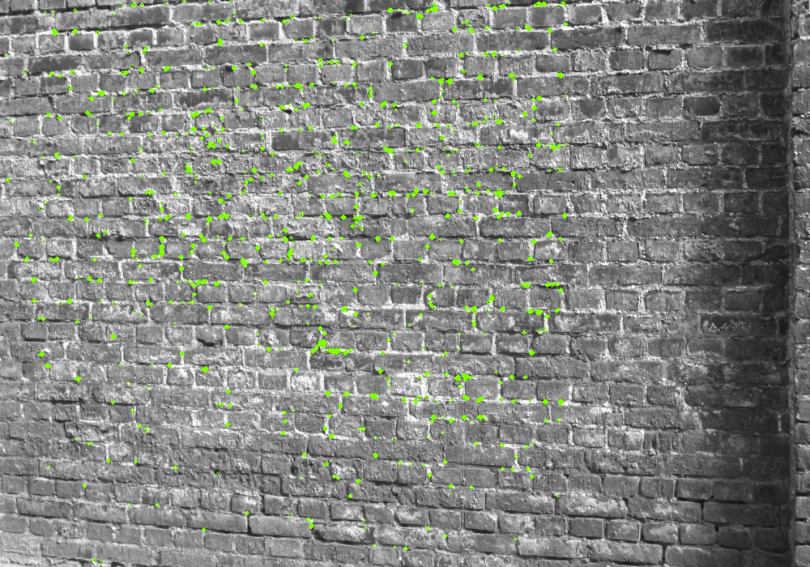
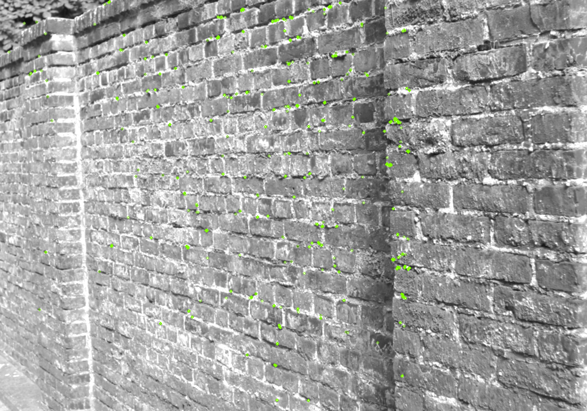
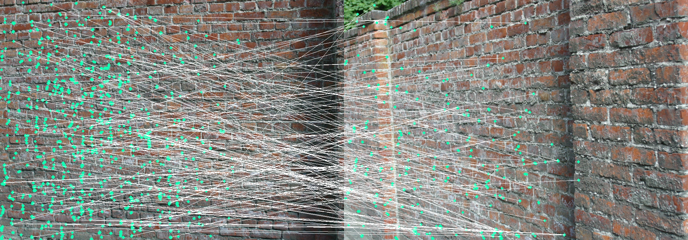

This script is for detecting features in an image and matching those features on another image taken at a different view angle.
I worked on it with some help from a class-mate on the matching part of the script.

